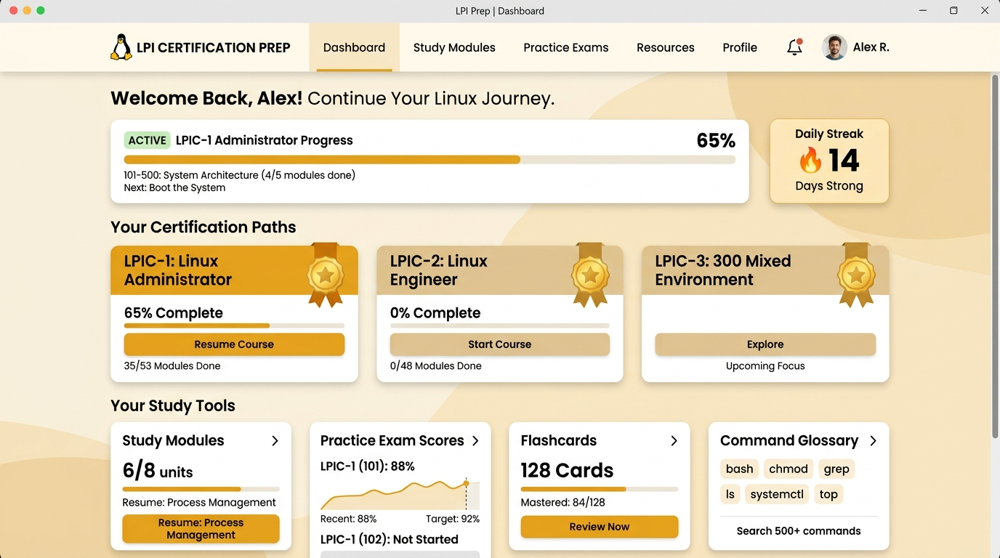

<div align="center">

  

  # 🐧 LPI Certification Prep
  ### Plateforme Offline-First de Préparation aux Certifications LPIC-1, LPIC-2 & LPIC-3

  [](https://reactjs.org/)
  [](https://www.typescriptlang.org/)
  [](https://tailwindcss.com/)
  [](#-installation-pwa)
  [](./docs/00_FUNCTIONAL_GUIDE.md)
  [](#-licence)

  <p align="center">
    <strong>Suite complète d'apprentissage interactif, de simulations d'examens chronométrés et de laboratoires avec terminal virtuel Linux simulé (VirtualFS).</strong>
  </p>

</div>

---

## 🖥️ Aperçu de l'Application

<div align="center">
  
</div>

---

## ✨ Fonctionnalités Principales

- **🎯 Moteur de Parcours Personnalisé (« Mon parcours LPIC »)** : Système complet d'apprentissage sur-mesure orienté vers un objectif précis de certification :
  - *Flux d'entraînement complet* : **Objectif** (LPIC-1 101/102, LPIC-2, LPIC-3, Linux Essentials) $\longrightarrow$ **Diagnostic** (matrice 6 domaines) $\longrightarrow$ **Parcours personnalisé** (temps disponible/jour, date cible) $\longrightarrow$ **Entraînement quotidien** (4 micro-tâches calibrées : révision syllabus, flashcards ciblées, mini-lab terminal, quiz questions ciblées) $\longrightarrow$ **Examens blancs chronométrés**.
  - *Indicateurs de progression en temps réel* : Niveau initial calculé, progression estimée (%), jours restants jusqu'à l'examen et jauge de maturité (*Ready, On Track, Intensive Training*).
- **🖥️ Terminal Virtuel & Labs Simulés (VirtualFS)** : Interpréteur de commandes Linux 100 % in-memory et PWA avec autocomplétion Tab, pages de manuel UNIX complètes (`man`, `help`, `--help`), et 14 scénarios d'ateliers pratiques évalués par analyse microscopique de l'état du système de fichiers virtuel :
  - *Filtrage & Flux* : `sed`, `awk`, `cut`, `sort`, `uniq`, `wc`, `tee`, pipes (`|`), redirections (`>`, `>>`).
  - *Services & Journaux Systemd* : `systemctl` (`status`, `start`, `stop`, `restart`, `enable`, `disable`), `journalctl` (`-u`, `-n`, `-r`, `-p`, `-xe`).
  - *Réseau & Routage* : `ip addr`, `ip link`, `ip route`, `ping` avec simulation de latence RTT réaliste et détection de connectivité.
  - *Stockage & Persistance* : `mount` (`-a`, `-o`), `umount`, `/etc/fstab`, inspection des partitions `fdisk` (`-l`) et arborescence bloc `lsblk` (`-f`).
  - *Droits, Processus & Système* : `chmod` (octal & symbolique), `chown`, `chgrp`, `umask`, `tar` (`-czvf`, `-xvf`), `ps` (`aux`, `-ef`), `kill` (`-9`), `uptime`, `free`, `df`.
- **🗺️ Carte Visuelle Interactive des Labs (`LinuxLabVisualMap`)** : Arborescence et roadmap interactive de tous les ateliers pratiques, avec suivi visuel en temps réel des acquis, filtrage par niveau et lancement direct des labs.
- **📝 Simulateur d'Examens Chronométrés (Barème 200–800)** : Simulations fidèles aux conditions Pearson VUE / LPI (LPIC-1 101/102, LPIC-2 201/202, LPIC-3) avec QCM et questions à saisie libre de commandes (*Fill-in-the-blank*), tolérance syntaxique intelligente et explications pédagogiques détaillées.
- **🧠 Flashcards avec Algorithme SRS (2 000+ cartes)** : Moteur de répétition espacée (dérivé de Leitner / SM-2) avec cartes flip 3D, calcul des révisions dues du jour et paliers d'auto-évaluation déterministes.
- **🚨 Ateliers Hands-On Pratiques** : Simulation d'astreinte (*Incident Response*), dépannage sur logs système (*Troubleshooting*), ordonnancement chronologique par glisser-déposer (*Sequencing*) et mini-jeux d'association.
- **🎯 Weakness Engine & Matrice de Compétences** : Détection algorithmique des angles morts et des sous-objectifs les plus fragiles pour des entraînements ciblés en 1 clic.
- **📖 Glossaire, Syntaxe & Graphe de Connaissances** : Dictionnaire complet des utilitaires Linux, décomposition anatomique des lignes de commandes, pièges d'examen et visualisation graphique des interconnexions (services, ports, fichiers FHS).
- **💡 Module « Explique-moi Autrement »** : Vulgarisation adaptative en 5 angles (Synthèse rapide, Métaphore débutant ELI5, Exemple terminal guidé, Mini-quiz de validation, Piège classique d'examen) avec support d'enrichissement IA optionnel.
- **📚 Lecteur de Documentation In-App & Bilingue (23 Fiches & ADRs en FR & EN)** : Visualiseur Markdown hors-ligne intégré accessible directement depuis le menu hamburger et l'en-tête, avec rendu typographique GFM complet (tableaux lisibles, listes de tâches, coloration de code monospace, filtres par phase) et basculement automatique FR / EN.
- **🌐 Expérience 100 % Bilingue & Offline-First** : Basculement instantané Français / Anglais sur toute l'application et sa documentation technique, et fonctionnement autonome garanti sans connexion Internet.
- **🔄 Gestion Dynamique des Versions & Profil Neutre** : Suivi des versions via `version.json` et `updateService`, réinitialisation propre du profil apprenant (statuts de certifications vierges par défaut).

---

## 🗺️ Cartographie Fonctionnelle des Écrans

L'application est structurée en **7 écrans principaux** et plusieurs modules transverses :

| Écran | Rôle Pédagogique Majeur | Fonctionnalités Clés |
| :--- | :--- | :--- |
| **Tableau de Bord** (`dashboard`) | Cockpit de pilotage & Diagnostic | Readiness Score (0-100%), Weakness Engine, calendrier de régularité (Daily Streak), métriques d'apprentissage et accès rapides. |
| **Curriculum Officiel** (`learning`) | Référentiel complet LPI | Programmes LPIC-1 (101/102), LPIC-2 (201/202) et LPIC-3, coefficients officiels (Weights 1 à 5), fiches d'objectifs détaillées. |
| **Mon parcours LPIC & Roadmap** (`path`) | Cursus sur-mesure & Progression | Moteur d'entraînement dynamique personnalisé (Objectif $\rightarrow$ Diagnostic $\rightarrow$ 4 micro-tâches du jour $\rightarrow$ Blancs), Parcours Métier thématiques (21 roadmaps) et Learning Map interactive. |
| **Flashcards SRS** (`flashcards`) | Mémorisation active à long terme | Flip-cards 3D, 4 boutons d'auto-évaluation (*Again, Hard, Good, Easy*), files d'attente et index complet de recherche parmi 2 000+ cartes. |
| **Simulateur d'Examens** (`practice`) | Immersion conditions réelles | 60 questions / 90 min, notation officielle 200–800 (seuil 500 pts), QCM et saisie libre de commandes, marquage pour revue et bilan complet. |
| **Glossaire & Explorateur** (`glossary`) | Encyclopédie & Graphe conceptuel | Recherche textuelle, décomposition anatomique d'instructions (options, drapeaux, pipes), pièges fréquents et graphe relationnel interactif. |
| **Hub d'Ateliers & Labs** (`training`) | Réflexes pratiques & Administration système | Shell Unix interactif (VirtualFS), 14 labs guidés avec carte visuelle interactive (`LinuxLabVisualMap`), astreinte d'urgence (*Incident Response*), dépannage sur logs (`journalctl`), ordonnancement chronologique (*Sequencing*), saisie de commandes (*Fill-in-the-blank*) et jeux d'association (*Matching*). |

> 👉 **Spécification détaillée écran par écran : [docs/00_FUNCTIONAL_GUIDE.md](./docs/00_FUNCTIONAL_GUIDE.md)**

---

## 🎯 Certifications LPI Couvertes

| Certification | Examens | Statut du Curriculum |
| :--- | :--- | :---: |
| **Linux Essentials** | Exam 010 | ✅ Couvert (Fondamentaux) |
| **LPIC-1** (Administrateur Linux) | Exam 101-500 & Exam 102-500 | ✅ 100 % Complet (10 topics) |
| **LPIC-2** (Ingénieur Linux) | Exam 201-450 & Exam 202-450 | ✅ 100 % Complet (Topics 200 à 212) |
| **LPIC-3 Enterprise** (Spécialiste) | 300 (Mixte/Samba), 303 (Sécurité), 305 (Virtualisation/Cloud), 306 (Haute Dispo) | ✅ Modules Dédiés |

---

## 🏗️ Architecture

Le projet adopte une architecture modulaire et découplée :
$$\text{UI Components} \longrightarrow \text{Domain Logic (SRS, Weakness, Analytics)} \longrightarrow \text{Services (VirtualFS, Shell)} \longrightarrow \text{Persistence (Storage)}$$

👉 **Voir la documentation complète de l'architecture : [docs/02_ARCHITECTURE.md](./docs/02_ARCHITECTURE.md)**

---

## 📚 Documentation Technique & Architecture (`docs/` & `docs/en/`)

La documentation interne du projet comprend **23 documents et ADRs complets**, disponibles en versions intégrales française (`docs/`) et anglaise (`docs/en/`), tous consultables en Markdown brut ou **directement dans l'application via le menu hamburger ou l'en-tête** avec rendu typographique GFM et basculement de langue automatique :

> 🇬🇧 **English documentation is available in [`docs/en/`](./docs/en/00_FUNCTIONAL_GUIDE.md) and [`docs/en/adr/`](./docs/en/adr/README.md).**

### Phase 1 — Spécifications Fonctionnelles & Modèles (Complète)
- **[00_FUNCTIONAL_GUIDE.md](./docs/00_FUNCTIONAL_GUIDE.md)** : **Guide fonctionnel des écrans & parcours utilisateur (spécification complète écran par écran).**
- **[00_OVERVIEW.md](./docs/00_OVERVIEW.md)** : Carte mentale du projet, flux d'interaction entre modules et parcours apprenant.
- **[01_PRODUCT.md](./docs/01_PRODUCT.md)** : Positionnement, personas et matrice de maturité (Existant / Planifié / Expérimental).
- **[02_ARCHITECTURE.md](./docs/02_ARCHITECTURE.md)** : Arborescence `src/`, modèle en couches et principes de découplage.
- **[04_DATA_MODEL.md](./docs/04_DATA_MODEL.md)** : Modèle conceptuel de données unifié (LPI Hierarchy, SRS, Weakness, VirtualFS).

### Phase 2 — Moteurs Métiers (Complète)
- **[06_LEARNING_ENGINE.md](./docs/06_LEARNING_ENGINE.md)** : Boucle pédagogique adaptative, diagnostic initial et parcours thématiques.
- **[07_SRS_ENGINE.md](./docs/07_SRS_ENGINE.md)** : Algorithme de répétition espacée, paliers déterministes et machine à états.
- **[08_WEAKNESS_ENGINE.md](./docs/08_WEAKNESS_ENGINE.md)** : Détection heuristique des lacunes, 7 domaines LPI et entraînements ciblés.
- **[09_LABS_ENGINE.md](./docs/09_LABS_ENGINE.md)** : Moteur de labs pratiques, terminal virtuel (VirtualFS), modélisation Systemd, stockage/fstab, réseau ICMP, et validation d'état microscopique des 14 scénarios.
- **[10_EXAM_ENGINE.md](./docs/10_EXAM_ENGINE.md)** : Échelle officielle 200–800, pondération, tolérance syntaxique aux commandes et analytics comportementales.

### Phase 3 — Infrastructure & PWA (Complète)
- **[12_I18N.md](./docs/12_I18N.md)** : Internationalisation bilingue FR/EN, typage strict des dictionnaires et détection navigateur.
- **[13_PWA_OFFLINE.md](./docs/13_PWA_OFFLINE.md)** : Architecture PWA, Service Worker, cache hybride et mises à jour transparentes.
- **[15_STORAGE.md](./docs/15_STORAGE.md)** : Contrats de stockage local, isolation des clés `lpi_*`, migration et export/import JSON.
- **[16_TESTING.md](./docs/16_TESTING.md)** : Stratégie de test multi-niveaux, typage statique TypeScript et validation des labs.

### Phase 4 — Évolution & Décisions (Complète)
- **[18_ROADMAP.md](./docs/18_ROADMAP.md)** : Trajectoire V1 (PWA) -> V2 (Wasm/IndexedDB) -> V3 (Desktop Tauri/Conteneurs natifs).
- **[19_DECISIONS.md](./docs/19_DECISIONS.md)** : Synthèse des choix d'architecture, compromis techniques et catalogue des ADRs.

### Architecture Decision Records (ADRs)
- **[Registre des Décisions](./docs/adr/README.md)**
  - [ADR-001 : PWA & Offline-First](./docs/adr/ADR-001-pwa-offline-first.md)
  - [ADR-002 : Virtual Linux Labs in-Memory](./docs/adr/ADR-002-virtual-linux-labs.md)
  - [ADR-003 : Contrats de Persistance Locale](./docs/adr/ADR-003-local-storage-contracts.md)
  - [ADR-004 : IA Optionnelle & Repli Déterministe](./docs/adr/ADR-004-ai-optional-fallback.md)
  - [ADR-005 : Parcours Thématiques Métiers vs Révision Linéaire](./docs/adr/ADR-005-learning-paths.md)
  - [ADR-006 : Stratégie Desktop & Conteneurs Natifs (V3)](./docs/adr/ADR-006-desktop-strategy.md)

---

## 🚀 Démarrage Rapide (Development)

### Prérequis
- Node.js 18+ ou Bun 1.1+

### Installation & Lancement
```bash
# 1. Cloner le dépôt
git clone https://github.com/votre-compte/lpi-certification-prep.git
cd lpi-certification-prep

# 2. Installer les dépendances
npm install
# ou : bun install

# 3. Démarrer le serveur de développement local
npm run dev

# 4. Ouvrir l'application
http://localhost:3000
```

### Compilation pour la Production
```bash
npm run build
```
Les fichiers statiques optimisés sont générés dans le dossier `dist/`, prêts à être déployés sur n'importe quel hébergeur statique ou conteneur.

---

## 📱 Installation PWA

L'application est 100 % installable sur ordinateur (Chrome, Edge, Safari macOS) et smartphone/tablette (Android, iOS) via le bouton **Installer** de la barre d'adresse. Une fois installée, elle fonctionne en mode autonome sans connexion réseau.

---

## 📄 Licence

Ce projet est sous licence [MIT](LICENSE) — libre pour un usage d'étude personnelle, en formation ou en entreprise.
